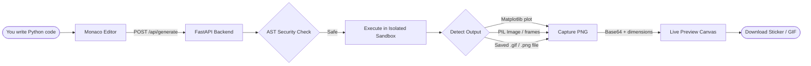

# Gifkers — Python Code & Visual Sticker Generator

<p align="center">
  
</p>

<p align="center">
  <b>Turn Python code snippets and visual outputs into high-resolution framed stickers and animated GIFs.</b>
</p>

<p align="center">
  <a href="https://github.com/SudiptaSanki/Gifkers/blob/main/LICENSE"></a>
  
  
  
  
  
</p>

---

## How It Works

Write any Python code using Matplotlib, Pillow, Seaborn, OpenCV, or NumPy. Click **Generate** and the backend executes your code in an isolated sandbox, captures the visual output (plots, images, GIFs), and streams it back to a live preview canvas. Download the result as a raw sticker, animated GIF, or a framed mockup card.



---

## Tech Stack

### Frontend
| Technology | Purpose |
| :--- | :--- |
| **React 19** | UI component framework |
| **Vite 6** | Dev server & production bundler |
| **TailwindCSS v4** | Dark theme responsive styling |
| **Monaco Editor** | VS Code-powered Python code editor |
| **Axios** | HTTP client for backend API |
| **html-to-image** | High-DPI canvas export helper |
| **Lucide React** | Icon set |

### Backend
| Dependency | Purpose |
| :--- | :--- |
| **FastAPI** | REST API server |
| **Uvicorn** | ASGI server |
| **Pillow** | Image creation, manipulation & GIF compilation |
| **Matplotlib** | Chart & plot rendering |
| **Seaborn** | Statistical data visualization |
| **OpenCV** | Image processing & computer vision |
| **NumPy** | Numerical computation for procedural graphics |
| **Pytest** | Unit & integration testing |

---

## Quick Start

### Prerequisites
- **Python 3.11+** — [python.org/downloads](https://www.python.org/downloads/)
- **Node.js 18+** — [nodejs.org](https://nodejs.org/)

### One-Click Launch (Windows)

```bash
git clone https://github.com/SudiptaSanki/Gifkers.git
cd Gifkers
```

Double-click **`run.bat`**.

> **First run** — automatically creates a Python virtual environment, installs all backend & frontend dependencies.  
> **Every run after** — skips installation, launches both servers instantly.

### Manual Setup

#### Backend
```bash
cd backend
python -m venv .venv
.venv\Scripts\activate        # Linux/Mac: source .venv/bin/activate
pip install -r requirements.txt
python -m uvicorn app.main:app --reload --port 8000
```

#### Frontend
```bash
cd frontend
npm install
npm run dev
```

Open [http://localhost:5173](http://localhost:5173) in your browser.

---

## Project Structure

```
Gifkers/
├── backend/
│   ├── app/
│   │   ├── main.py          # FastAPI routes & CORS
│   │   ├── executor.py      # Sandboxed Python execution engine
│   │   ├── security.py      # AST pre-execution security analyzer
│   │   ├── schemas.py       # Pydantic request/response models
│   │   └── config.py        # App settings
│   ├── tests/
│   │   ├── test_main.py     # API endpoint tests
│   │   └── test_executor.py # Execution engine tests
│   └── requirements.txt
│
├── frontend/
│   ├── src/
│   │   ├── components/      # CodeEditor, ControlPanel, FrameCanvas, etc.
│   │   ├── hooks/           # useStickerGenerator custom hook
│   │   ├── utils/           # API client & export helpers
│   │   └── App.jsx
│   └── package.json
│
├── run.bat                  # Smart one-click launcher
├── LICENSE
└── README.md
```

---

## Running Tests

```bash
cd backend
python -m pytest -v --tb=short
```

---

## License

[MIT](LICENSE)
