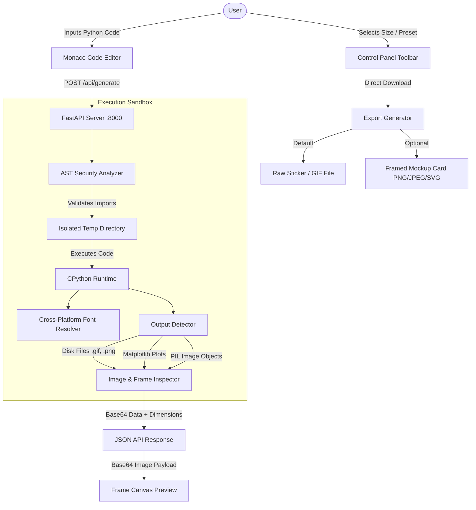

# Gifkers - Offline Python Code & Visual Sticker Generator

<p align="center">
  
</p>

<p align="center">
  <b>An open-source offline tool to turn Python code snippets and visual outputs into high-resolution framed stickers and animated GIFs.</b>
</p>

<p align="center">
  <a href="https://github.com/SudiptaSanki/Gifkers/blob/main/LICENSE"></a>
  
  
  
  
  
</p>

---

## 🌟 Key Features

- **VS Code Monaco Editor**: Write, paste, and run Python code directly in your browser.
- **Universal Library Support**: Execute Matplotlib, Seaborn, Pillow, OpenCV, and NumPy scripts locally.
- **Automatic Code Dimension Detection**: Reads output size (e.g. `550 × 220 px`) automatically with bi-directional pixel controls.
- **Sticker & Animated GIF Capture**: Detects generated `.gif`, `.png`, `.jpg`, `.webp` files, Matplotlib plots, or PIL image frames.
- **Export Options**: Download raw transparent stickers/GIFs directly, or save framed card mockups in PNG, JPEG, or SVG formats.
- **Glassmorphic Themes**: Custom background gradient presets (Electric Cyan, Sunset Glow, Neon Cyberpunk, Emerald Forest, Deep Onyx).

---

## 🚀 System Architecture



---

## ⚡ Quick Start (Smart One-Click Launcher)

This repository includes a **Smart `run.bat` Script** designed for zero-configuration offline execution:

1. Clone the repository:
   ```bash
   git clone https://github.com/SudiptaSanki/Gifkers.git
   cd Gifkers
   ```
2. Double-click **`run.bat`**.

### How `run.bat` Works:
- **First Run**: Automatically creates a Python virtual environment (`.venv`), installs backend packages, installs frontend `node_modules`, and launches the servers.
- **Subsequent Runs**: Automatically detects existing dependencies, **skips re-installation**, and opens the web application directly in your default browser!

---

## 🛠️ Manual Installation Guide

### Backend Setup
```bash
cd backend
python -m venv .venv
source .venv/bin/activate        # On Windows: .venv\Scripts\activate
pip install -r requirements.txt
python -m uvicorn app.main:app --reload --port 8000
```

### Frontend Setup
```bash
cd frontend
npm install
npm run dev
```

---

## 🧪 Testing

Run the automated backend Pytest suite:
```bash
cd backend
python -m pytest -v --tb=short
```

---

## 📄 License
This repository is licensed under the [MIT License](LICENSE).
